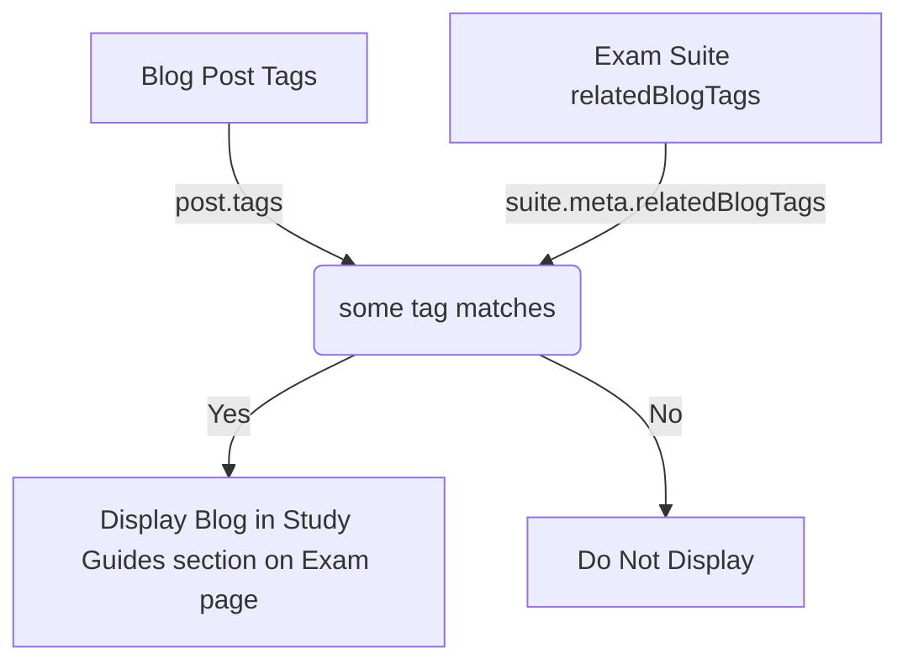

# 🏷️ Blog & Exam Tag Nomenclature Guide

This guide establishes the rules and best practices for tagging blog posts (`blog/blog-index.json`) and linking them to specific exam suites in the master configuration (`config.json`). 

Adhering to these conventions ensures that our internal linking remains accurate, category pages load relevant content, and the blog filter UI remains clean and professional.

---

## 🏗️ 1. Architecture: How Tag Linking Works

The frontend `Examify` application features dynamic category pages (e.g., the page for WAEC, HOSA, or IELTS) that automatically display relevant study guides, news, and updates. 

This relationship is established dynamically through **tags**, rather than hardcoded URLs.

### The Matching Mechanism
In `CategoryPage.tsx`, the application determines if a blog post is related to an exam suite using an **OR matching condition**:

```typescript
const relatedBlogs = useMemo(() => {
    if (!suite || !suite.meta.relatedBlogTags) return [];
    return blogIndex.filter(post =>
        post.tags?.some(tag => suite.meta.relatedBlogTags!.includes(tag))
    ).slice(0, 3); // Displays a maximum of 3 blogs
}, [suite, blogIndex]);
```



---

## ⚠️ 2. The Critical Rule: No Generic Tags in `config.json`

Because the linking logic uses a `some()` / `includes()` OR match, we must divide our tags into two distinct categories:

1.  **Generic Tags:** (e.g., `Exam Prep`, `Mock Tests`, `Study Guides`) used by readers on the Blog List Page to filter posts.
2.  **Specific Tags:** (e.g., `WAEC`, `HOSA`, `LSO`) used to map specific posts to specific exams.

> [!CAUTION]
> **NEVER add a Generic Tag to the `relatedBlogTags` array in `config.json`.**
> If you put `Exam Prep` in `config.json` for a suite (e.g., WASCCE), then **any** blog post tagged with `Exam Prep` (e.g., a guide about the LSO Canadian Paralegal Exam or IELTS) will show up as a recommended study guide on the WASSCE page. 
> 
> Only place **highly specific** tags in the `relatedBlogTags` list in `config.json`.

---

## 📐 3. Rules of Tag Formatting

To prevent tag clutter and maintain UI consistency, follow these three rules:

### I. Use Title Case
Tags must use Title Case (Capitalizing the first letter of each word).
*   **Correct:** `Exam Simulator`, `Mock Tests`, `Nigerian Education`
*   **Incorrect:** `exam simulator`, `mock_tests`, `NIGERIAN EDUCATION`

### II. Absolute Ban on Years in Tags
Never include years in tags. The application uses the `date` property of the blog post to handle chronology.
*   **Correct:** `WAEC`, `HOSA`, `ACT`
*   **Incorrect:** `WAEC 2026`, `HOSA 2025-2026`, `ACT 2026 Guide`
*   *Why?* Tags containing years become stale quickly, fragment search filters, and require ongoing manual cleanup.

### III. Consolidate and Reuse Synonyms
Avoid creating redundant tags for similar concepts.
*   **Correct:** Use `Exam Prep`
*   **Incorrect:** `Study Tips`, `Study Hacks`, `Prep Tips`
*   **Correct:** Use `Mock Tests`
*   **Incorrect:** `Mock Exam`, `Free Exams`, `Sample Questions`

---

## 🗃️ 4. Standard Tag Registry

When writing or editing blog posts and configurations, choose from the standardized tag families below:

### General & Platform Tags (Blog Index Only)
*   **General Prep:** `Exam Prep`, `Study Guides`, `Mock Tests`
*   **Platform Features:** `ExamOven`, `Exam Simulator`, `Privacy`, `AI Tools`
*   **Site News & Updates:** `Admit Card`, `Syllabus Updates`, `Exam Dates`, `Results`

### Specific Exam & Organization Tags (Used in BOTH `blog-index.json` and `config.json`)
*   **HOSA Event:** `HOSA`, `Health Science Competition`, `Forensic Science`, `Nutrition Science`
*   **FBLA Event:** `FBLA`, `Business Competition`, `Marketing Fundamentals`
*   **West African Exams:** `WAEC`, `WASSCE`, `NECO`, `BECE`, `Junior WAEC`, `Senior Secondary`, `Nigerian Education`
*   **General Academic / Admissions:** `ACT`, `College Admissions`, `Standardized Testing`, `IELTS`, `English Proficiency`, `Study Abroad`, `CAT`, `MBA Entrance`, `IIM`
*   **Professional Licensure:** `CPPB`, `Public Procurement`, `Government Purchasing`, `UPPCC`, `LSO`, `Paralegal`, `P1 Exam`, `Law Society of Ontario`, `Ontario Licensing`
*   **Regional/Language Specific:** `Concours Médecine Belgique`, `ARES FWB`, `Études de Médecine`, `Préparation Concours`

---

## 🛠️ 5. Workflows for Developers & Editors

### A. When Writing a New Blog Post
1.  Add the markdown file to `blog/`.
2.  Open `blog/blog-index.json`.
3.  Add the post entry. Under the `tags` array:
    *   Include generic tags for user-filtering (e.g. `["Exam Prep", "Mock Tests"]`).
    *   Include the **exact specific tags** corresponding to the exam suites you want this post to display on.
4.  Run `npm run serve` (or verify in local UI) to ensure the post appears on the correct exam pages.

### B. When Creating a New Exam Suite Config
1.  Open `config.json` and add your new exam configuration block under the relevant key.
2.  Define the `relatedBlogTags` array in the `meta` section.
3.  **Ensure** the tags are highly specific (e.g., `"NIMCET"`, `"MCA Entrance"`). Do **not** include generic tags.
4.  If there are existing blog posts that should link to this exam, locate them in `blog/blog-index.json` and append the new specific tags to their `tags` arrays.
